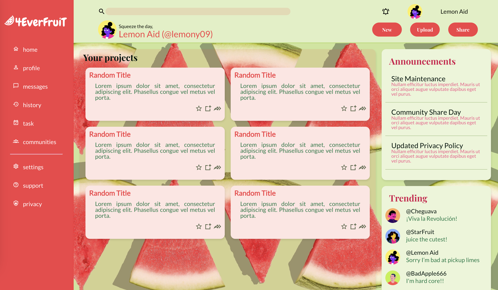

# Admin Dashboard
build with SCSS and CSS grid

This is a Sign-up-Form project inspired by [The Odin Project](https://www.theodinproject.com/)

## Table of contents

- [Overview](#overview)
  - [Concept](#the-challenge)
  - [Screenshot](#screenshot)
  - [Links](#links)
- [My process](#my-process)
  - [Built with](#built-with)
  - [What I learned](#what-i-learned)
  - [Continued development](#continued-development)
  - [Useful resources](#useful-resources)
- [Author](#author)

## Overview

### Concept
A Dashboard design built with CSS grid. 

### Screenshot

### Links

- [Live Site URL](https://kure-ru.github.io/Sign-up-Form/)

## My process

### Built with

- HTML5
- CSS3
- SASS

### What I learned
- [How to structure your typography in Sass](https://chipcullen.com/how-to-structure-your-typography-in-sass/)
- [Using CSS filters to change SVG colours](https://medium.com/@charlotte.pearce1984/using-css-filters-to-change-svg-colours-2b4887c1a5db)

### 

### Useful resources
- [icons](https://pictogrammers.com/library/mdi/)
- [Free Userpics Pack](https://userpics.craftwork.design/)
-[A Complete Guide to CSS Grid](https://css-tricks.com/snippets/css/complete-guide-grid/)
 - Picture by <a href="https://unsplash.com/@amyshamblen?utm_source=unsplash&utm_medium=referral&utm_content=creditCopyText">Amy Shamblen</a> on <a href="https://unsplash.com/fr/photos/euqiHwS38Rw?utm_source=unsplash&utm_medium=referral&utm_content=creditCopyText">Unsplash</a>
  

## Author

- [Claire](https://github.com/Kure-ru)

